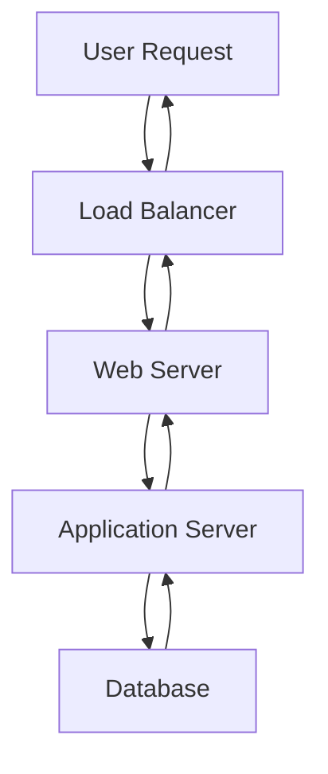

# /docs-add

Adds new documentation pages, sections, or content to an existing Docusaurus site with intelligent content generation and organization.

## Usage

```bash
/docs-add [$ARGUMENTS]
```

## Context-Aware Behavior

The command intelligently analyzes existing documentation structure and determines the best placement and type:

- **No arguments**: Creates general documentation page with inferred title from current directory
- **No `/docs` folder**: Suggests running `/docs-init` first
- **Existing structure**: Analyzes current organization (guides/, api/, tutorials/, etc.)
- **Smart placement**: Automatically determines appropriate category and location
- **Content inference**: Detects content type from `$ARGUMENTS` keywords (guide, api, tutorial, diagram, etc.)
- **Title extraction**: Uses `$ARGUMENTS` as title if no type keyword detected

## Description

Creates new documentation content with intelligent structure, examples, and integration into the existing Docusaurus site. The command provides templates and wizards to ensure consistent, high-quality documentation across your project.

### Content Type Details

#### 1. Guides (`guide`)

**Purpose:** How-to documentation that walks users through specific tasks or workflows.

**Generated Structure:**

```markdown
# {TITLE}

## Overview

Brief description of what this guide covers and who it's for.

## Prerequisites

- List of requirements
- Dependencies needed
- Prior knowledge assumed

## Step-by-Step Instructions

### Step 1: Initial Setup

Detailed instructions with code examples.

### Step 2: Configuration

Continue with logical progression.

### Step 3: Verification

How to confirm everything is working.

## Troubleshooting

Common issues and solutions.

## Next Steps

Links to related documentation or advanced topics.
```

**Example Output:**

````markdown
# Setting Up Authentication

## Overview

This guide shows how to implement user authentication using JWT tokens in your application.

## Prerequisites

- Node.js 16+ installed
- Basic knowledge of Express.js
- A running database instance

## Step 1: Install Dependencies

```bash
npm install jsonwebtoken bcryptjs express-rate-limit
```
````

## Step 2: Create Authentication Middleware

```javascript
const jwt = require("jsonwebtoken");

function authenticateToken(req, res, next) {
  const authHeader = req.headers["authorization"];
  const token = authHeader && authHeader.split(" ")[1];

  if (token == null) return res.sendStatus(401);

  jwt.verify(token, process.env.ACCESS_TOKEN_SECRET, (err, user) => {
    if (err) return res.sendStatus(403);
    req.user = user;
    next();
  });
}
```

````
#### 2. Reference Documentation (`reference`)

**Purpose:** Comprehensive technical documentation for APIs, functions, or system components.

**Generated Structure:**
```markdown
# {TITLE} Reference

## Overview
Brief description and scope of the reference.

## Quick Reference
Summary table or list of key items.

## Detailed Documentation

### Function/Method Name
- **Description:** What it does
- **Parameters:** Input parameters with types
- **Returns:** Return value and type
- **Examples:** Code examples
- **See Also:** Related functions or concepts

## Error Codes
Common errors and their meanings.

## Migration Notes
Changes between versions if applicable.
````

#### 3. Tutorials (`tutorial`)

**Purpose:** Step-by-step learning experiences that build understanding progressively.

**Generated Structure:**

```markdown
# {TITLE} Tutorial

## What You'll Learn

Clear learning objectives.

## What You'll Build

Description of the end result.

## Prerequisites

Required knowledge and setup.

## Tutorial Steps

### Part 1: Foundation

Basic concepts and setup.

### Part 2: Core Implementation

Main functionality development.

### Part 3: Advanced Features

Extended capabilities.

### Part 4: Testing & Deployment

Quality assurance and going live.

## Summary

Recap of what was accomplished.

## Further Reading

Next steps and advanced topics.
```

#### 4. Troubleshooting (`troubleshooting`)

**Purpose:** Problem-solving documentation for common issues and error resolution.

**Generated Structure:**

```markdown
# {TITLE} Troubleshooting

## Common Issues

### Issue: Error Message or Symptom

**Symptoms:** What the user experiences
**Cause:** Why this happens
**Solution:** Step-by-step fix
**Prevention:** How to avoid in the future

## Diagnostic Tools

Commands and techniques for investigating problems.

## Getting Help

When and how to escalate issues.
```

#### 5. Diagram Pages (`diagram`)

**Purpose:** Visual documentation using Mermaid diagrams for architecture, flows, and relationships.

**Mermaid Integration:**

- Automatically configured when Docusaurus is initialized with diagram support
- Supports all Mermaid diagram types (flowcharts, sequence diagrams, Gantt charts, etc.)
- Renders directly in documentation without external dependencies

**Available Templates:**

- `architecture` - System architecture diagrams
- `flow` - Process and workflow diagrams
- `sequence` - Sequence and interaction diagrams
- `database` - Database schema and relationships
- `deployment` - Deployment and infrastructure diagrams

**Generated Structure:**

````markdown
# {TITLE}

## Overview

Context and purpose of the diagram.


````

## Components

### Component Name

Description of each major component shown in the diagram.

## Data Flow

Explanation of how data moves through the system.

## Related Documentation

Links to detailed documentation for each component.

````
**Example Mermaid Diagrams:**

Architecture Diagram:
```mermaid
graph TB
    subgraph "Client Layer"
        Web[Web App]
        Mobile[Mobile App]
        CLI[CLI Tool]
    end
    
    subgraph "API Gateway"
        Gateway[API Gateway]
        Auth[Authentication]
        Rate[Rate Limiting]
    end
    
    subgraph "Services"
        UserSvc[User Service]
        DataSvc[Data Service]
        NotifSvc[Notification Service]
    end
    
    subgraph "Data Layer"
        DB[(Database)]
        Cache[(Cache)]
        Queue[(Message Queue)]
    end
    
    Web --> Gateway
    Mobile --> Gateway
    CLI --> Gateway
    
    Gateway --> Auth
    Gateway --> Rate
    Gateway --> UserSvc
    Gateway --> DataSvc
    Gateway --> NotifSvc
    
    UserSvc --> DB
    DataSvc --> DB
    NotifSvc --> Queue
    UserSvc --> Cache
````

Sequence Diagram:

```mermaid
sequenceDiagram
    participant Client
    participant API
    participant Auth
    participant DB
    
    Client->>API: POST /auth/login
    API->>Auth: Validate credentials
    Auth->>DB: Query user
    DB-->>Auth: User data
    Auth-->>API: JWT token
    API-->>Client: 200 OK + token
```

#### 6. API Documentation (`api`)

**Purpose:** Structured API documentation with endpoints, schemas, and examples.

**Generated Structure:**

```markdown
# {TITLE} API

## Overview

API purpose and base URL.

## Authentication

How to authenticate requests.

## Endpoints

### GET /endpoint

- **Description:** What this endpoint does
- **Parameters:** Query and path parameters
- **Request Example:** Sample request
- **Response Example:** Sample response
- **Error Codes:** Possible error responses

## SDKs and Libraries

Available client libraries.

## Rate Limiting

Usage limits and policies.
```

### Smart Content Integration

**Automatic Sidebar Updates:**

- Detects appropriate category placement
- Maintains logical ordering
- Updates `sidebars.js` configuration
- Preserves existing custom organization

**Cross-Reference Generation:**

- Links to related existing documentation
- Suggests connections between new and existing content
- Updates "See Also" sections automatically
- Maintains documentation graph integrity

**Content Templates:**

- Uses project-specific patterns and styles
- Maintains consistent formatting and structure
- Incorporates existing terminology and conventions
- Adapts to project's documentation standards

### Advanced Features

#### Automatic Enhancement Detection

**Language-Aware Generation:**

- Analyzes project structure to determine primary languages
- Generates examples in appropriate syntax (TypeScript, Go, Rust, Java)
- Uses project's existing code patterns and conventions
- Includes proper imports and dependencies from `$ARGUMENTS` context

**OpenAPI Integration:**

- Automatically detects `openapi.yaml` or `swagger.json` files
- Generates comprehensive API documentation when "api" in `$ARGUMENTS`
- Creates request/response examples with proper schemas
- Includes authentication requirements and error responses

**Mermaid Diagram Support:**

- Automatically detects when "diagram" keyword is in `$ARGUMENTS`
- Creates appropriate Mermaid syntax based on diagram type
- Supports flowcharts, sequence diagrams, class diagrams, and more
- Integrates seamlessly with Docusaurus Mermaid theme

## Examples

### Create documentation with auto-detection:

```bash
/docs-add
```

### Create a guide with auto-detected placement:

```bash
/docs-add guide Quick Start
```

### Add API documentation:

```bash
/docs-add api REST API
```

### Create tutorial with smart organization:

```bash
/docs-add tutorial Building Your First Widget
```

### Add a system diagram:

```bash
/docs-add diagram System Overview
```

### Create troubleshooting page:

```bash
/docs-add troubleshooting Common Issues
```

### Simple title-based creation:

```bash
/docs-add Getting Started with Authentication
```

## File Organization

**Generated Files:**

```
docs/
├── guides/
│   └── quick-start-guide.md
├── reference/
│   └── rest-api.md
├── tutorials/
│   └── building-your-first-widget.md
├── troubleshooting/
│   └── common-deployment-issues.md
├── diagrams/
│   └── system-overview.md
└── configuration/
    └── environment-setup.md
```

**Sidebar Integration:**

```javascript
// sidebars.js automatically updated
module.exports = {
  docsSidebar: [
    "intro",
    {
      type: "category",
      label: "Guides",
      items: ["guides/quick-start-guide"],
    },
    {
      type: "category",
      label: "API Reference",
      items: ["reference/rest-api"],
    },
    {
      type: "category",
      label: "Tutorials",
      items: ["tutorials/building-your-first-widget"],
    },
    // ... other categories
  ],
};
```

## Integration with Other Commands

- Use after `/docs-init` to build out documentation structure
- Combine with `/docs-update` to refresh auto-generated content
- Integrate with `/diagram` for standalone diagram creation
- Use with `/api-docs` for comprehensive API documentation

## Prerequisites

- Existing `/docs` folder with Docusaurus installation
- Valid `sidebars.js` configuration file
- Write permissions to documentation directory

## Post-Creation Workflow

After creating new documentation:

1. **Review and Edit:**
   - Customize generated content for your specific needs
   - Add project-specific examples and details
   - Verify links and cross-references

2. **Preview Changes:**
   ```bash
   deno task docs
   ```

3. **Update Related Documentation:**
   ```bash
   /docs-update --sidebar
   ```

4. **Validate Content:**
   ```bash
   /docs-update --validate
   ```
