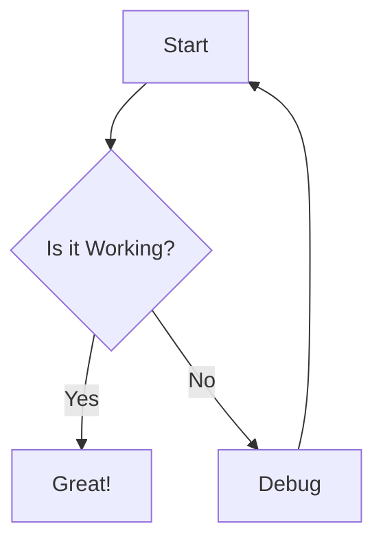

## Context

- Current directory: !`pwd`
- Project name (from git remote): !`basename -s .git "$(git config --get remote.origin.url 2>/dev/null)" || echo "my-docs"`
- Node.js version: !`node --version 2>/dev/null || echo "Node.js not installed"`
- npm version: !`npm --version 2>/dev/null || echo "npm not installed"`

## Your task

Create a minimal Docusaurus documentation site in `/docs/` folder with TypeScript support and diagram capabilities.

### Step 1: Validate environment

Check that Node.js and npm are installed. If not, inform the user they need to install Node.js first.

### Step 2: Create Docusaurus project

Use npx to create a new Docusaurus project with TypeScript:

```bash
npx create-docusaurus@latest docs classic --typescript
```

Note: Use "docs" as the directory name to match the dotfiles convention.

### Step 3: Set up the minimal configuration

After project creation, update the key configuration files to match the minimal setup:

1. **Update docusaurus.config.ts** with:
   - Simple title and tagline
   - GitHub Pages configuration with automatic URL detection from git remote
   - Support for both GitHub Actions and branch deployment methods
   - Classic preset with minimal navbar
   - Light mode by default (defaultMode: "light")
   - Comprehensive syntax highlighting with additionalLanguages:
     ```typescript
     additionalLanguages: [
       "bash",
       "typescript",
       "rust",
       "go",
       "java",
       "python",
       "yaml",
       "docker", // Note: use "docker" not "dockerfile"
     ];
     ```
     **Important:** Only include languages that aren't already built-in. The following are included by default: javascript, css, json, markdown, markup (HTML/XML)
   - No blog (set blog: false)

2. **Simplify sidebars.ts** to have a basic structure:
   - getting-started/
   - configuration/
   - reference/

3. **Update package.json** scripts to include standard commands:
   - start, build, serve, deploy, typecheck

### Step 4: Install and configure diagram support

Install the Mermaid diagram plugin:

```bash
cd docs && npm install --save @docusaurus/theme-mermaid
```

Then update docusaurus.config.ts to include:

- Import the mermaid theme
- Add markdown.mermaid = true
- Configure the theme with mermaid support

Example configuration snippet for docusaurus.config.ts:

```typescript
import { themes as prismThemes } from "prism-react-renderer";
import type { Config } from "@docusaurus/types";
import type * as Preset from "@docusaurus/preset-classic";

const config: Config = {
  // ... other config ...

  markdown: {
    mermaid: true,
  },

  themes: ["@docusaurus/theme-mermaid"],

  themeConfig: {
    // ... other theme config ...

    prism: {
      theme: prismThemes.github,
      darkTheme: prismThemes.dracula,
      additionalLanguages: [
        "bash",
        "typescript",
        "rust",
        "go",
        "java",
        "python",
        "yaml",
        "docker",
      ],
    },

    colorMode: {
      defaultMode: "light",
      disableSwitch: false,
      respectPrefersColorScheme: true,
    },
  } satisfies Preset.ThemeConfig,
};
```

### Step 5: Create minimal starter content

Create the basic documentation structure:

1. **docs/getting-started/installation.md** - Basic installation guide
2. **docs/getting-started/quick-start.md** - Quick start guide
3. **docs/configuration/index.md** - Configuration overview
4. **docs/reference/index.md** - Reference documentation

Each file should have proper frontmatter with sidebar_position.

### Step 6: Customize the homepage

1. Update src/pages/index.tsx with a simple hero section
2. Create src/components/HomepageFeatures.tsx with project-specific features
3. Update src/css/custom.css with minimal styling

#### Customizing HomepageFeatures.tsx

Replace the default HomepageFeatures.tsx with a project-specific version. Here's a template:

```typescript
import React from "react";
import clsx from "clsx";
import styles from "./HomepageFeatures.module.css";

type FeatureItem = {
  title: string;
  description: JSX.Element;
};

// Customize these features based on your project
const FeatureList: FeatureItem[] = [
  {
    title: "Easy to Use",
    description: (
      <>
        Describe how your project simplifies a complex task or provides an intuitive interface for
        users.
      </>
    ),
  },
  {
    title: "Built for Developers",
    description: (
      <>
        Highlight developer-friendly features like CLI tools, APIs, extensibility, or integration
        capabilities.
      </>
    ),
  },
  {
    title: "Production Ready",
    description: (
      <>
        Emphasize reliability, performance, security features, or battle-tested nature of your
        project.
      </>
    ),
  },
];

function Feature({ title, description }: FeatureItem) {
  return (
    <div className={clsx("col col--4")}>
      <div className="text--center padding-horiz--md">
        <h3>{title}</h3>
        <p>{description}</p>
      </div>
    </div>
  );
}

export default function HomepageFeatures(): JSX.Element {
  return (
    <section className={styles.features}>
      <div className="container">
        <div className="row">
          {FeatureList.map((props, idx) => <Feature key={idx} {...props} />)}
        </div>
      </div>
    </section>
  );
}
```

Example project-specific features to consider:

- **For a CLI tool**: "Cross-platform Support", "Zero Configuration", "Extensive Plugin System"
- **For a library**: "Type-Safe", "Tree-Shakeable", "Framework Agnostic"
- **For a service**: "High Availability", "Auto-scaling", "Multi-region Support"
- **For dev tools**: "Hot Reload", "Built-in Testing", "IDE Integration"

### Step 7: Add TypeScript configuration

Ensure tsconfig.json is properly configured for Docusaurus development.

### Step 8: Initialize git (if not in a git repo)

If the current directory is not a git repository, initialize one:

```bash
cd docs && git init
```

### Step 9: Configure GitHub Pages deployment

Set up GitHub Pages deployment using one of two methods:

#### Option A: GitHub Actions Workflow (Recommended)

Create `.github/workflows/deploy-docs.yml` for automatic deployment on push:

```yaml
name: Deploy Docusaurus to GitHub Pages

on:
  push:
    branches: [main]
  workflow_dispatch:

permissions:
  contents: read
  pages: write
  id-token: write

concurrency:
  group: "pages"
  cancel-in-progress: false

jobs:
  build:
    runs-on: ubuntu-latest
    steps:
      - uses: actions/checkout@v4
      - uses: actions/setup-node@v4
        with:
          node-version: 20
          cache: npm
          cache-dependency-path: docs/package-lock.json
      - name: Install dependencies
        run: npm ci
        working-directory: docs
      - name: Build website
        run: npm run build
        working-directory: docs
      - name: Upload artifact
        uses: actions/upload-pages-artifact@v3
        with:
          path: docs/build

  deploy:
    environment:
      name: github-pages
      url: ${{ steps.deployment.outputs.page_url }}
    runs-on: ubuntu-latest
    needs: build
    steps:
      - name: Deploy to GitHub Pages
        id: deployment
        uses: actions/deploy-pages@v4
```

Then enable GitHub Pages in repository settings:

1. Go to Settings → Pages
2. Under "Build and deployment", select "GitHub Actions" as the source
3. The workflow will automatically deploy on the next push to main

#### Option B: Branch Deployment (Legacy)

For branch-based deployment:

1. Build the site locally: `cd docs && npm run build`
2. Deploy to gh-pages branch: `cd docs && npm run deploy`
3. In repository settings → Pages:
   - Source: "Deploy from a branch"
   - Branch: "gh-pages"
   - Folder: "/ (root)"

**Note**: The `npm run deploy` command requires the following in docusaurus.config.ts:

```typescript
const config: Config = {
  // ... other config ...
  url: "https://username.github.io",
  baseUrl: "/repository-name/",
  organizationName: "username", // GitHub org/user name
  projectName: "repository-name", // repo name
  deploymentBranch: "gh-pages",
  trailingSlash: false,
};
```

### Step 10: Configure custom domain (optional)

To use a custom domain:

1. **Add CNAME file**: Create `docs/static/CNAME` with your domain:
   ```
   docs.example.com
   ```

2. **Configure DNS**:
   - For apex domain (example.com): Add A records pointing to GitHub's IPs
   - For subdomain (docs.example.com): Add CNAME record pointing to `username.github.io`

3. **Update docusaurus.config.ts**:
   ```typescript
   url: 'https://docs.example.com',
   baseUrl: '/',
   ```

4. **Enable in GitHub**:
   - Go to Settings → Pages
   - Add custom domain and verify
   - Enable "Enforce HTTPS"

### Step 11: Configure Deno tasks for documentation

Update or create `deno.json` in the project root to include documentation tasks:

```json
{
  "tasks": {
    "docs": "cd docs && npm start",
    "docs:dev": "cd docs && npm start",
    "docs:build": "cd docs && npm run build",
    "docs:serve": "cd docs && npm run serve",
    "docs:deploy": "cd docs && npm run deploy",
    "docs:install": "cd docs && npm install",
    "docs:typecheck": "cd docs && npm run typecheck"
  }
}
```

This allows you to run documentation commands using Deno:

- `deno task docs` - Start the development server
- `deno task docs:build` - Build the static site
- `deno task docs:serve` - Serve the built site locally
- `deno task docs:deploy` - Deploy to GitHub Pages (branch method)

### Step 12: Final setup instructions

Provide the user with:

1. **Development server**: `deno task docs` or `cd docs && npm start`
2. **Build command**: `deno task docs:build` or `cd docs && npm run build`
3. **Deployment**:
   - GitHub Actions: Push to main branch (automatic)
   - Manual: `deno task docs:deploy` (requires GH_TOKEN or SSH)
4. **Site URL**:
   - Default: `https://username.github.io/repository-name/`
   - Custom domain: Configure in repository settings
5. **Mermaid diagrams**: Use in any markdown file (see example below)

### Example Mermaid diagram usage:

````markdown

````

The site should be minimal, clean, and ready for documentation with full TypeScript support, diagram capabilities, and GitHub Pages deployment.

### GitHub Pages Configuration Details

Docusaurus will automatically configure for GitHub Pages when it detects a GitHub remote. The configuration includes:

- **URL Structure**: `https://[username].github.io/[repository-name]/`
- **Base URL**: Set to `/[repository-name]/` for project sites
- **Organization/User**: Extracted from git remote
- **Deployment Branch**: Default to `gh-pages`

For user/organization sites (username.github.io repos), set baseUrl to `/`.

### Troubleshooting Common Issues

#### Prism Language Errors

If you see errors like `Cannot find module './prism-<language>'`:

1. **Check the exact language name**: Language names must match the Prism component file names exactly
   - Use `docker` not `dockerfile`
   - Use `bash` not `shell`
   - HTML/XML syntax is provided by `markup` (included by default)

2. **Don't add default languages**: These are already included and will cause errors if added to `additionalLanguages`:
   - `javascript`, `jsx`, `typescript`, `tsx`
   - `css`, `scss`
   - `json`
   - `markdown`
   - `markup` (HTML/XML)

3. **Verify language availability**: Check `node_modules/prismjs/components/` for available language files:
   ```bash
   ls node_modules/prismjs/components/ | grep "prism-.*\.js$" | grep -v min
   ```

4. **Clear cache after changes**: Always clear Docusaurus cache after modifying language configuration:
   ```bash
   npm run clear
   ```
