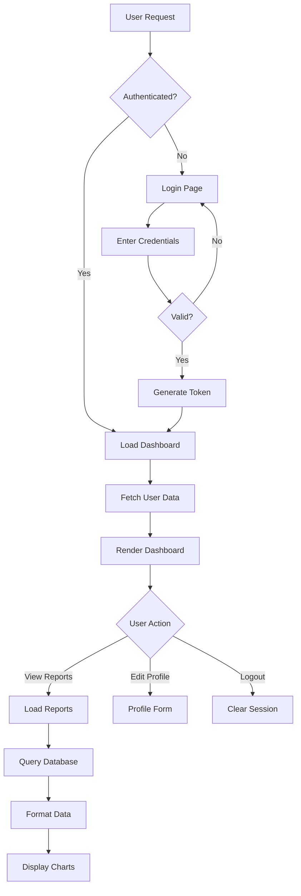
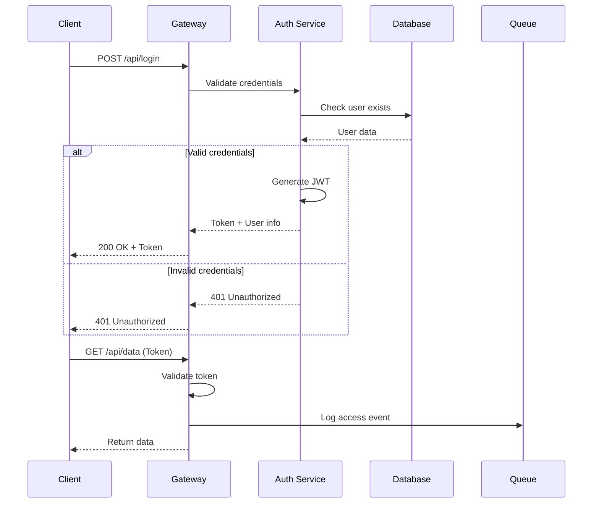
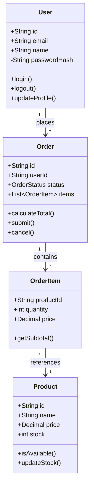
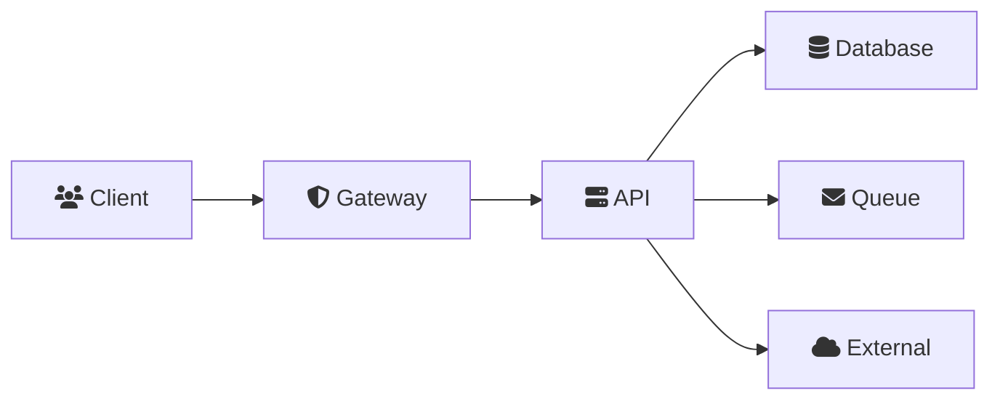
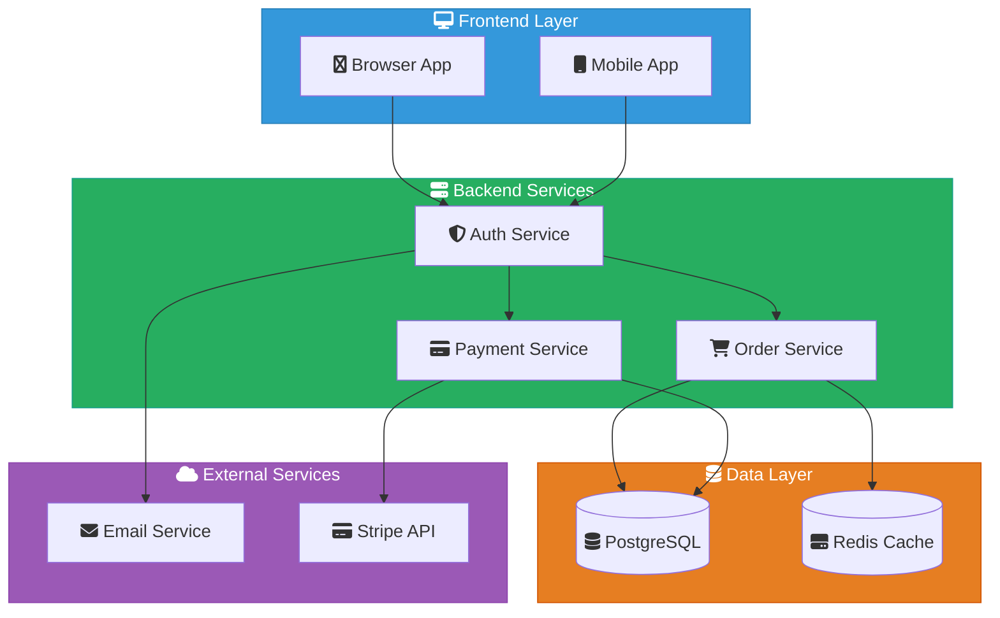
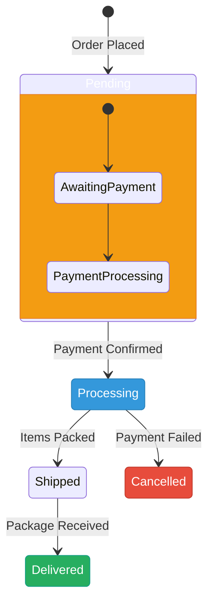

## Context

- Session ID: !`gdate +%s%N`
- Project files: !`fd -t f -e ts -e js -e rs -e go -e java -e py . | head -20`
- Main entry points: !`fd "^(main|index|app)\\.(ts|js|rs|go|java|py)$" . | head -10`
- Package info: !`fd "^(package\\.json|Cargo\\.toml|go\\.mod|pom\\.xml|requirements\\.txt)$" . | head -5`
- Mermaid CLI available: !`which mmdc > /dev/null && echo "yes" || echo "no"`

## Your task

PROCEDURE generate_diagram():

STEP 1: Parse request parameters

- Extract diagram type from $ARGUMENTS (default: architecture)
- Valid types: architecture, flow, sequence, class, entity, component
- Extract scope/focus area if provided
- FOR complex analysis: think hard about the optimal diagram structure

STEP 2: Analyze codebase structure

- IF scope provided:
  - Focus analysis on specific area: !`fd -t f "$SCOPE" . | head -20`
- ELSE:
  - Scan project structure: !`fd -t f -e ts -e js -e rs -e go -e java -e py . | wc -l`
  - Identify main components: !`fd -t d -d 2 . | head -20`

STEP 3: Gather relevant information

FOR diagram_type:
CASE "architecture":

- Find service boundaries: !`fd -t d "(service|module|component)" . | head -10`
- Identify databases: !`rg -i "(postgres|mysql|mongo|redis)" --type-add 'config:*.{yml,yaml,json,env}' -t config`
- Locate API layers: !`rg "@(Controller|Route|Api)" -t ts -t js -t java`

CASE "flow":

- Trace request flow: !`rg "(router|route|endpoint)" -A 2`
- Find middleware: !`rg "middleware|interceptor|filter" -l`

CASE "class":

- Extract classes: !`rg "^\\s*(export\\s+)?class\\s+\\w+" -o`
- Find inheritance: !`rg "extends|implements" -B 1`

CASE "sequence":

- Identify actors: !`rg "(client|server|service|api)" -i`
- Map interactions: !`rg "(call|request|response|emit)" -A 2`

STEP 4: Generate diagram

- Choose appropriate format (ASCII for simplicity, Mermaid for complexity)
- FOR complex diagrams: Use sub-agents for parallel analysis
- Structure output with clear component boundaries
- Add directional flows and relationships
- Apply consistent color themes and icons (see Visual Design Guidelines)

STEP 5: Export diagram (if mmdc available)

- Save Mermaid diagram to temp file: /tmp/diagram-$SESSION_ID.mmd
- IF mmdc available AND user requests image:
  - Generate PNG: mmdc -i /tmp/diagram-$SESSION_ID.mmd -o diagram.png
  - Generate SVG: mmdc -i /tmp/diagram-$SESSION_ID.mmd -o diagram.svg
  - Report output location

STEP 6: Enhance with documentation

- Add component descriptions
- Document key relationships
- Include architectural decisions
- Provide usage notes

## Diagram Examples

### Architecture Diagram (ASCII)

```
┌─────────────────────────────────────────────────────────────┐
│                      Frontend (React/Fresh)                  │
│  ┌─────────────┐  ┌──────────────┐  ┌─────────────────┐   │
│  │   Browser   │  │   Mobile App │  │   CLI Client    │   │
│  └──────┬──────┘  └──────┬───────┘  └────────┬────────┘   │
└─────────┼─────────────────┼──────────────────┼─────────────┘
          │                 │                  │
          └─────────────────┴──────────────────┘
                            │
                  ┌─────────▼─────────┐
                  │   Load Balancer   │
                  │    (HAProxy)      │
                  └─────────┬─────────┘
                            │
        ┌───────────────────┴───────────────────┐
        │                                       │
┌───────▼────────┐                    ┌────────▼────────┐
│   API Gateway  │                    │  Static Assets  │
│  (Kong/Envoy)  │                    │     (CDN)       │
└───────┬────────┘                    └─────────────────┘
        │
┌───────┴────────────────────────────────────┐
│              Microservices                  │
│  ┌──────────┐  ┌──────────┐  ┌──────────┐ │
│  │   Auth   │  │  Orders  │  │ Payments │ │
│  │ Service  │  │ Service  │  │ Service  │ │
│  └────┬─────┘  └────┬─────┘  └────┬─────┘ │
└───────┼─────────────┼─────────────┼───────┘
        │             │             │
        └─────────────┴─────────────┘
                      │
         ┌────────────┴────────────┐
         │                         │
┌────────▼────────┐      ┌─────────▼────────┐
│    PostgreSQL   │      │   Message Queue  │
│   (Primary DB)  │      │    (RabbitMQ)    │
└─────────────────┘      └──────────────────┘
```

#### Flow Diagram (Mermaid)



#### Sequence Diagram



#### Class Diagram



#### Entity Relationship Diagram

```
┌─────────────────┐         ┌─────────────────┐
│     users       │         │    orders       │
├─────────────────┤         ├─────────────────┤
│ id          PK  │────┐    │ id          PK  │
│ email       UQ  │    │    │ user_id     FK  │
│ name            │    └───>│ status          │
│ created_at      │         │ total           │
│ updated_at      │         │ created_at      │
└─────────────────┘         └────────┬────────┘
                                     │
                            ┌────────▼────────┐
                            │   order_items   │
                            ├─────────────────┤
                            │ id          PK  │
                            │ order_id    FK  │
                            │ product_id  FK  │
                            │ quantity        │
                            │ price           │
                            └────────┬────────┘
                                     │
                            ┌────────▼────────┐
                            │    products     │
                            ├─────────────────┤
                            │ id          PK  │
                            │ name            │
                            │ price           │
                            │ stock           │
                            │ category_id FK  │
                            └─────────────────┘
```

### Component Diagram

```
┌───────────────────────────────────────────────────┐
│                  Frontend Layer                    │
│  ┌─────────────┐ ┌──────────────┐ ┌────────────┐ │
│  │   Header    │ │   Dashboard  │ │   Footer   │ │
│  │ Component   │ │  Component   │ │ Component  │ │
│  └──────┬──────┘ └──────┬───────┘ └─────┬──────┘ │
│         └────────────────┴───────────────┘        │
│                          │                         │
│                   ┌──────▼──────┐                 │
│                   │  App State  │                 │
│                   │  (Redux)    │                 │
│                   └──────┬──────┘                 │
└──────────────────────────┼────────────────────────┘
                           │
                    ┌──────▼──────┐
                    │  API Client │
                    │   (Axios)   │
                    └──────┬──────┘
                           │
┌──────────────────────────┼────────────────────────┐
│                   Backend Layer                    │
│                   ┌──────▼──────┐                 │
│                   │  REST API   │                 │
│                   │  Controller │                 │
│                   └──────┬──────┘                 │
│         ┌────────────────┼────────────────┐       │
│         │                │                │       │
│  ┌──────▼──────┐ ┌──────▼──────┐ ┌──────▼──────┐│
│  │   Service   │ │   Service   │ │   Service   ││
│  │    Layer    │ │    Layer    │ │    Layer    ││
│  └──────┬──────┘ └──────┬──────┘ └──────┬──────┘│
│         └────────────────┼────────────────┘       │
│                   ┌──────▼──────┐                 │
│                   │ Data Access │                 │
│                   │    Layer    │                 │
│                   └──────┬──────┘                 │
└──────────────────────────┼────────────────────────┘
                           │
                    ┌──────▼──────┐
                    │  Database   │
                    │ (PostgreSQL)│
                    └─────────────┘
```

### Mermaid CLI Usage

```bash
# Convert Mermaid diagram to PNG
mmdc -i diagram.mmd -o diagram.png

# Convert to SVG with custom theme
mmdc -i diagram.mmd -o diagram.svg -t dark

# Generate PDF with custom config
mmdc -i diagram.mmd -o diagram.pdf -c config.json

# Batch convert multiple diagrams
fd "\.mmd$" . -x mmdc -i {} -o {.}.png
```

### Theme Configuration

Create a `mermaid-config.json` for consistent styling:

```json
{
  "theme": "base",
  "themeVariables": {
    "primaryColor": "#3498db",
    "primaryTextColor": "#fff",
    "primaryBorderColor": "#2980b9",
    "lineColor": "#34495e",
    "secondaryColor": "#27ae60",
    "tertiaryColor": "#e67e22",
    "background": "#ffffff",
    "mainBkg": "#ecf0f1",
    "secondBkg": "#bdc3c7",
    "tertiaryBkg": "#95a5a6",
    "textColor": "#2c3e50",
    "fontSize": "16px",
    "fontFamily": "Arial, sans-serif",
    "nodeSpacing": 50,
    "rankSpacing": 100
  },
  "flowchart": {
    "curve": "basis",
    "nodeSpacing": 30,
    "rankSpacing": 50,
    "useMaxWidth": true
  },
  "sequence": {
    "diagramMarginX": 50,
    "diagramMarginY": 10,
    "actorMargin": 50,
    "width": 150,
    "height": 65
  }
}
```

Use with: `mmdc -i diagram.mmd -o diagram.png -c mermaid-config.json`

### State Management for Complex Diagrams

```json
// /tmp/diagram-state-$SESSION_ID.json
{
  "sessionId": "1234567890",
  "phase": "analyzing",
  "components": [],
  "relationships": [],
  "diagrams": {
    "architecture": null,
    "flow": null,
    "sequence": null
  },
  "exports": []
}
```

### Auto-Generation Script

```typescript
// generate-diagram.ts
import { walk } from "@std/fs/walk.ts";

async function generateArchitectureDiagram(rootPath: string) {
  const components: Map<string, string[]> = new Map();

  // Scan for components
  for await (const entry of walk(rootPath)) {
    if (entry.isFile && entry.name.endsWith(".ts")) {
      const content = await Deno.readTextFile(entry.path);

      // Extract imports
      const imports = content.match(/import.*from\s+['"](.+)['"]/g);
      if (imports) {
        components.set(entry.path, imports);
      }
    }
  }

  // Generate mermaid diagram
  let diagram = "graph TD\n";

  components.forEach((imports, file) => {
    const fileName = file.split("/").pop()?.replace(".ts", "");
    imports.forEach((imp) => {
      const dep = imp.match(/['"](.+)['"]/)?.[1];
      if (dep && !dep.startsWith("@") && !dep.startsWith(".")) {
        diagram += `  ${fileName} --> ${dep}\n`;
      }
    });
  });

  return diagram;
}
```

### Visual Design Guidelines

#### Color Themes

Use consistent color schemes based on component types:

```mermaid
%%{init: {'theme':'base', 'themeVariables': {
  'primaryColor':'#ff6b6b',
  'primaryTextColor':'#fff',
  'primaryBorderColor':'#ff4757',
  'lineColor':'#5f27cd',
  'secondaryColor':'#4834d4',
  'tertiaryColor':'#30336b',
  'background':'#f5f3f0',
  'mainBkg':'#ffffff',
  'secondBkg':'#f1f2f6',
  'tertiaryBkg':'#dfe4ea'
}}}%%
```

**Standard Color Assignments:**

- **Frontend/UI**: Blue tones (#3498db, #2980b9)
- **Backend/API**: Green tones (#27ae60, #16a085)
- **Database**: Orange tones (#e67e22, #d35400)
- **Security/Auth**: Red tones (#e74c3c, #c0392b)
- **External Services**: Purple tones (#9b59b6, #8e44ad)
- **Infrastructure**: Gray tones (#7f8c8d, #34495e)
- **Message Queues**: Yellow tones (#f1c40f, #f39c12)

#### Icon System

Use standardized icons for component types:



**Component Icons:**

- **Users/Clients**: fa:fa-users, fa:fa-mobile, fa:fa-desktop
- **Security**: fa:fa-shield-alt, fa:fa-lock, fa:fa-key
- **Services**: fa:fa-server, fa:fa-cogs, fa:fa-microchip
- **Data Storage**: fa:fa-database, fa:fa-hdd, fa:fa-archive
- **Messaging**: fa:fa-envelope, fa:fa-comments, fa:fa-paper-plane
- **Cloud/External**: fa:fa-cloud, fa:fa-globe, fa:fa-satellite
- **Monitoring**: fa:fa-chart-line, fa:fa-tachometer-alt, fa:fa-eye

#### Mermaid Styling Examples

**Architecture Diagram with Colors and Icons:**



**State Diagram with Themed Colors:**



#### ASCII Art Icon Conventions

For ASCII diagrams, use text-based icon representations:

```
[DB]    - Database
[API]   - API Service
[Q]     - Message Queue
[CDN]   - Content Delivery Network
[LB]    - Load Balancer
[GW]    - Gateway
[AUTH]  - Authentication Service
[CACHE] - Cache Layer
[LOG]   - Logging Service
[MON]   - Monitoring
```

Example with ASCII icons:

```
┌─────────────────────────────────────────┐
│            [CDN] Static Assets          │
└────────────────┬────────────────────────┘
                 │
         ┌───────▼────────┐
         │  [LB] HAProxy  │
         └───────┬────────┘
                 │
    ┌────────────┴────────────┐
    │                         │
┌───▼─────┐            ┌─────▼──────┐
│  [API]  │            │   [AUTH]   │
│ Gateway │            │  Service   │
└───┬─────┘            └─────┬──────┘
    │                        │
    └───────────┬────────────┘
                │
         ┌──────▼──────┐
         │    [DB]     │
         │ PostgreSQL  │
         └─────────────┘
```

### Extended Thinking for Complex Diagrams

FOR complex architectural decisions:

- think hard about component boundaries and relationships
- think harder about data flow and security boundaries
- Consider scalability and deployment patterns

### Sub-Agent Delegation Pattern

FOR large codebases, use parallel analysis:

```markdown
Analyze this codebase for diagram generation using 5 parallel agents:

1. Frontend structure and components
2. Backend services and APIs
3. Database schemas and relationships
4. External integrations and dependencies
5. Infrastructure and deployment configuration
```

## Output Format

```markdown
# ${DiagramType} Diagram

## Overview

[Brief description of what the diagram shows]

## Diagram

[ASCII or Mermaid diagram]

## Key Components

- **Component A**: Description
- **Component B**: Description
- **Component C**: Description

## Relationships

- A → B: Data flow for X
- B → C: Triggers Y process
- C → A: Returns Z result

## Notes

- [Important architectural decisions]
- [Scalability considerations]
- [Security boundaries]
```

## Best Practices

### Diagram Design

1. **Keep it simple** - Focus on key components
2. **Use consistent symbols** - Stick to standard notations
3. **Label clearly** - Add descriptive labels
4. **Show data flow** - Indicate direction with arrows
5. **Group related items** - Use boxes/boundaries
6. **Include legend** - Explain symbols if needed

### Visual Consistency

1. **Color by Function** - Use the standard color assignments consistently
2. **Icon Standards** - Apply FontAwesome icons for familiar visual language
3. **Theme Adherence** - Use predefined themes across all diagrams
4. **Accessibility** - Ensure sufficient contrast for readability
5. **Component Shapes** - Rectangles for services, cylinders for databases, diamonds for decisions

### Performance Optimization

1. **Use caching** - Store analyzed components in state file
2. **Incremental updates** - Only re-analyze changed files
3. **Parallel analysis** - Use sub-agents for large codebases
4. **Selective rendering** - Generate only requested diagram types

## Advanced Features

### Automatic Diagram Updates

```bash
# Watch for changes and regenerate
fd -e ts -e js . -x echo {} | entr sh -c 'claude code "/diagram architecture"'
```

### CI/CD Integration

```yaml
# GitHub Action example
- name: Generate Architecture Diagrams
  run: |
    claude code "/diagram architecture" > architecture.mmd
    mmdc -i architecture.mmd -o docs/architecture.png
    mmdc -i architecture.mmd -o docs/architecture.svg
```

### Multi-Format Export

PROCEDURE export_all_formats():

- Generate base Mermaid diagram
- Export as PNG for README
- Export as SVG for web docs
- Export as PDF for reports
- Create ASCII version for CLI

## Error Handling

TRY:

- Analyze codebase
- Generate diagram
- Export formats
  CATCH (missing dependencies):
- Fall back to ASCII output
- Document missing tools
  FINALLY:
- Clean up temp files: rm /tmp/diagram-$SESSION_ID.*
