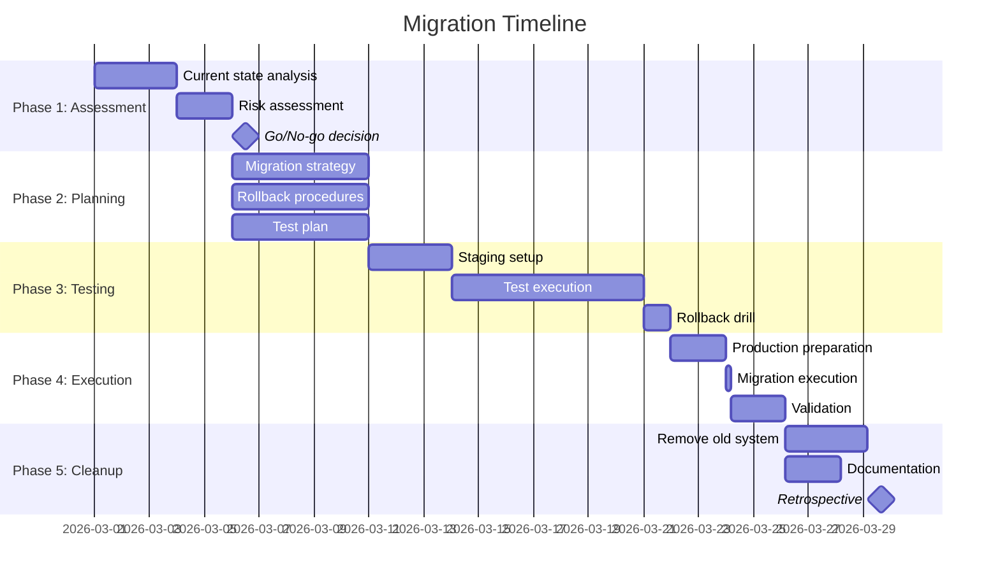

# Migration Team Reference

Patterns, checklists, and frameworks for planning and executing migrations.

## Migration Risk Assessment Framework

### Risk Dimensions

1. **Technical Complexity**
   - Low: Configuration changes only
   - Medium: Code changes, backward compatible
   - High: Breaking changes, data schema modifications

2. **Data Volume**
   - Low: < 10GB, < 1M records
   - Medium: 10GB-1TB, 1M-100M records
   - High: > 1TB, > 100M records

3. **System Criticality**
   - Low: Internal tools, dev environments
   - Medium: Customer-facing, degraded mode acceptable
   - High: Revenue-critical, zero downtime required

4. **Reversibility**
   - Easy: Feature flag toggle
   - Medium: Rollback script required
   - Hard: Data loss possible, manual intervention

### Risk Matrix

| Complexity | Data Volume | Criticality | → Recommended Approach |
|------------|-------------|-------------|------------------------|
| Low | Low | Low | **Big Bang** - single cutover |
| Low | Medium | Medium | **Blue-Green** - parallel systems |
| High | High | High | **Incremental Canary** - gradual rollout |
| Any | Any | High | **Dual Write + Backfill** - zero downtime |

## Migration Patterns

### 1. Big Bang Migration

**When to use**: Low risk, low data volume, acceptable downtime

**Steps**:
1. Announce maintenance window
2. Stop writes to old system
3. Export data
4. Transform and load to new system
5. Validate
6. Switch traffic

**Pros**: Simple, fast execution
**Cons**: Downtime required, high rollback cost

---

### 2. Blue-Green Deployment

**When to use**: Zero downtime required, can run both systems in parallel

**Steps**:
1. Deploy new system (green) alongside old (blue)
2. Dual-write to both systems
3. Backfill historical data to green
4. Validate green matches blue
5. Switch read traffic to green (instant cutover)
6. Monitor, rollback to blue if issues
7. Decommission blue after soak period

**Pros**: Instant rollback, zero downtime
**Cons**: 2x infrastructure cost during migration

---

### 3. Canary Deployment

**When to use**: High risk, gradual rollout needed

**Steps**:
1. Deploy new version to small % of traffic (1%)
2. Monitor metrics (errors, latency, business KPIs)
3. Gradually increase % (1% → 5% → 25% → 50% → 100%)
4. Rollback at any stage if issues detected
5. Fully decommission old after 100% soak

**Pros**: Limited blast radius, data-driven rollout
**Cons**: Requires traffic splitting, longer timeline

---

### 4. Dual Write + Backfill

**When to use**: Database migrations, zero downtime, large data volumes

**Steps**:
1. **Phase 1**: Dual-write new records to both old and new
2. **Phase 2**: Backfill historical data (batched, off-peak)
3. **Phase 3**: Validate consistency (compare old vs new)
4. **Phase 4**: Switch reads to new system
5. **Phase 5**: Stop writes to old system
6. **Phase 6**: Decommission old after validation period

**Pros**: Zero downtime, reversible at each phase
**Cons**: Complex implementation, data consistency challenges

---

### 5. Strangler Fig Pattern

**When to use**: Framework/language upgrades, monolith decomposition

**Steps**:
1. Build new system alongside old
2. Intercept requests with proxy/router
3. Route new features to new system
4. Gradually migrate existing features (module by module)
5. Old system "strangles" over time until empty
6. Decommission when 100% migrated

**Pros**: Incremental, low risk per module
**Cons**: Long timeline, complexity of maintaining both

---

## Rollback Decision Framework

### Automatic Rollback Triggers

Set alerts that auto-rollback if exceeded:

```yaml
error_rate:
  threshold: +50% from baseline
  window: 5 minutes
  action: automatic rollback

latency_p99:
  threshold: +100% from baseline
  window: 10 minutes
  action: automatic rollback

availability:
  threshold: < 99.5%
  window: 5 minutes
  action: automatic rollback

business_metric:  # e.g., checkout success rate
  threshold: -10% from baseline
  window: 15 minutes
  action: alert + manual decision
```

### Manual Rollback Criteria

**Trigger rollback if**:
- Critical functionality broken
- Data corruption detected
- Security vulnerability introduced
- Performance degradation > 2x
- Customer complaints spike
- Rollback window closing (time-based deadline)

**Do NOT rollback if**:
- Minor edge case bugs (fix forward)
- Cosmetic issues
- Expected temporary performance dip
- Already past point of no return (data schema changed)

---

## Data Migration Validation Checklist

### Pre-Migration
- [ ] Schema validated in staging
- [ ] Row counts match between systems
- [ ] Sample data integrity checks pass
- [ ] Foreign key constraints validated
- [ ] Indexes and performance optimizations in place

### During Migration
- [ ] Dual-write logs show consistency
- [ ] Backfill progress monitored
- [ ] No data loss detected
- [ ] Replication lag within acceptable bounds

### Post-Migration
- [ ] Row counts match exactly
- [ ] Random sampling shows identical data
- [ ] Critical queries return same results
- [ ] Performance meets or exceeds baseline
- [ ] No orphaned records
- [ ] Audit trail complete

---

## Performance Impact Assessment

### Metrics to Baseline

| Metric | Pre-Migration | Target | Alert Threshold |
|--------|---------------|--------|-----------------|
| Read latency (p50) | | < baseline | > 1.5x baseline |
| Read latency (p99) | | < 2x baseline | > 3x baseline |
| Write latency (p50) | | < baseline | > 1.5x baseline |
| Throughput (QPS) | | ≥ baseline | < 0.8x baseline |
| Error rate | | < baseline | > 2x baseline |
| CPU utilization | | < 80% | > 90% |
| Memory usage | | < 80% | > 90% |
| Disk I/O | | < baseline | > 2x baseline |

### Load Testing Scenarios

1. **Steady State**: Current production load for 1 hour
2. **Peak Load**: 2x peak historical traffic
3. **Burst**: 10x load for 5 minutes (flash traffic)
4. **Soak**: Baseline load for 24 hours (memory leaks)
5. **Chaos**: Random failures during load (resilience)

---

## Communication Templates

### Pre-Migration Announcement

```
Subject: [ACTION REQUIRED] System Migration - [Date]

Team,

We will be migrating [system] from [old] to [new] on [date].

IMPACT:
- Downtime: [none | X hours]
- User impact: [none | read-only mode | full outage]
- Affected services: [list]

TIMELINE:
- [Date Time]: Migration start
- [Date Time]: Expected completion
- [Date Time]: Rollback deadline

WHAT YOU NEED TO DO:
- [Action items for stakeholders]

CONTACT:
- On-call: [person/rotation]
- Slack: [channel]
- Status page: [URL]

ROLLBACK PLAN:
- [Summary of rollback procedure]
- [RTO/RPO estimates]

Questions? Reply to this email or join [Slack channel].
```

### During Migration Status Update

```
Migration Status Update - [Time]

✅ Completed:
- [Step 1]
- [Step 2]

🚧 In Progress:
- [Step 3] - 45% complete, ETA 30 minutes

⏳ Upcoming:
- [Step 4]
- [Step 5]

📊 Metrics:
- Error rate: [X%] (baseline: [Y%])
- Latency: [X ms] (baseline: [Y ms])
- Data migrated: [X GB / Y GB]

🚨 Issues:
- [None | Issue description + resolution]

Next update: [Time]
```

### Post-Migration Retrospective Template

```markdown
# Migration Retrospective: [Name]

**Date**: [Date]
**Duration**: [Actual vs Planned]
**Outcome**: [Success | Partial Success | Rolled Back]

## What Went Well
- [Item 1]
- [Item 2]

## What Went Wrong
- [Issue 1]
  - Root cause: [analysis]
  - Impact: [scope]
  - Resolution: [how fixed]

## Surprises
- [Unexpected thing that happened]

## Metrics
| Metric | Baseline | Post-Migration | Delta |
|--------|----------|----------------|-------|
| ... | ... | ... | ... |

## Action Items
- [ ] [Item 1] - Owner: [Name], Due: [Date]
- [ ] [Item 2] - Owner: [Name], Due: [Date]

## Lessons Learned
- [Lesson 1]
- [Lesson 2]

## Documentation Updates
- [ ] Update runbooks
- [ ] Update architecture diagrams
- [ ] Update team wiki
- [ ] Share learnings with wider team
```

---

## Common Migration Pitfalls

### 1. Insufficient Testing
**Symptom**: Issues discovered in production
**Prevention**: Staging environment mirrors production, load testing at 2x peak

### 2. Underestimated Timeline
**Symptom**: Migration takes 3x longer than planned
**Prevention**: Add 50% buffer, break into smaller phases

### 3. No Rollback Plan
**Symptom**: Stuck in broken state, no way back
**Prevention**: Test rollback in staging, define rollback deadline upfront

### 4. Data Inconsistency
**Symptom**: Old and new systems show different results
**Prevention**: Dual-write validation, row-by-row comparison

### 5. Performance Regression
**Symptom**: New system slower than old
**Prevention**: Benchmark early, optimize before cutover

### 6. Incomplete Dependency Mapping
**Symptom**: Unexpected systems break
**Prevention**: Dependency audit, integration testing

### 7. Poor Communication
**Symptom**: Stakeholders surprised by downtime
**Prevention**: Announce early, send status updates, retrospective

---

## Zero-Downtime Migration Checklist

- [ ] Can run old and new systems in parallel
- [ ] Traffic can be split/routed dynamically
- [ ] Dual-write implemented and tested
- [ ] Data consistency validation automated
- [ ] Rollback is instantaneous (traffic switch)
- [ ] No schema changes that break old system
- [ ] Monitoring dashboards show both systems
- [ ] Load tested at 2x current peak
- [ ] Canary rollout plan defined
- [ ] Stakeholders aware migration is invisible to them

---

## Migration Timeline Template



Use this as a starting template and adjust phases/durations based on risk assessment.
