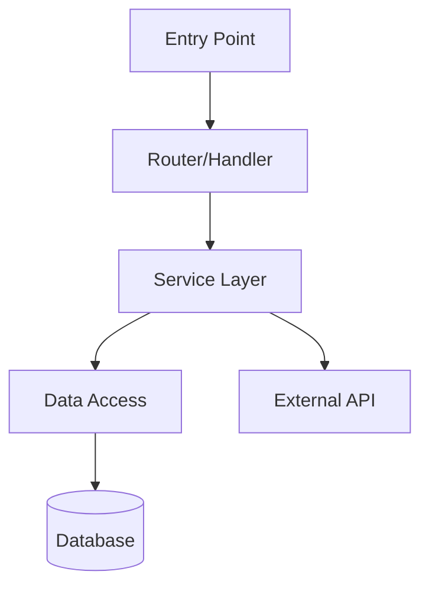

# Codebase Onboarding

Systematically explore an unfamiliar codebase and produce an ARCHITECTURE.md that gives a developer everything they need to start contributing.

## When to Use

- Joining a new team or project
- Picking up an open-source repo to contribute to
- Revisiting a codebase after a long absence
- Onboarding a teammate who needs a guided tour

## Workflow

### 1. Survey the Repository Structure

Start with a high-level scan of the repo layout:

```bash
# Top-level structure
ls -la

# Directory tree (2-3 levels deep)
find . -maxdepth 3 -type d -not -path './.git*' -not -path './node_modules*' -not -path './.direnv*' -not -path './target*' -not -path './dist*' -not -path './.next*' | sort

# Count files by extension to identify primary languages
find . -type f -not -path './.git/*' -not -path './node_modules/*' | sed 's/.*\.//' | sort | uniq -c | sort -rn | head -20

# Repo size and scale
find . -type f -not -path './.git/*' -not -path './node_modules/*' | wc -l
```

### 2. Identify the Tech Stack

Read key configuration files to determine the stack:

**Check for these files (in order of priority):**

| File | Reveals |
|------|---------|
| `package.json` | Node.js ecosystem, dependencies, scripts |
| `Cargo.toml` | Rust crate, dependencies |
| `go.mod` | Go module, dependencies |
| `pyproject.toml` / `setup.py` / `requirements.txt` | Python project |
| `flake.nix` / `default.nix` | Nix-managed project |
| `Makefile` / `Justfile` | Build commands and workflows |
| `docker-compose.yml` / `Dockerfile` | Containerization |
| `.github/workflows/*.yml` | CI/CD pipeline |
| `tsconfig.json` | TypeScript configuration |
| `.tool-versions` / `.mise.toml` | Runtime version management |

Read each config file that exists. Note:
- Primary language(s) and framework(s)
- Build tool and task runner
- Package manager
- Test framework
- Linter/formatter
- Key dependencies (the ones that define the architecture)

### 3. Find Entry Points

Locate where execution begins:

```bash
# Common entry points
find . -maxdepth 3 -name "main.*" -o -name "index.*" -o -name "app.*" -o -name "server.*" -o -name "cli.*" | grep -v node_modules | grep -v .git

# API routes / handlers
find . -maxdepth 4 -type d -name "routes" -o -name "handlers" -o -name "controllers" -o -name "api" | grep -v node_modules

# Binary / executable definitions
# (Check Cargo.toml [[bin]], package.json "bin", go main packages, etc.)
```

Read 2-3 entry point files to understand the application bootstrap.

### 4. Map the Architecture

Trace the major components by reading key files:

**Identify components:**
- What are the top-level directories and what does each own?
- Which directories represent distinct services, packages, or modules?
- Where does business logic live vs. infrastructure vs. presentation?

**Trace data flow:**
- Follow a request from entry point through the layers
- Identify the database/storage layer
- Map external service integrations
- Note message queues, event buses, or async patterns

**Draw a Mermaid component diagram:**



Adapt this to the actual architecture found. Include the key components and their relationships.

### 5. Catalog Patterns and Conventions

Search for recurring patterns:

```bash
# Error handling patterns
rg "catch|Error|Result<|anyhow|thiserror|raise|except" --type-list
rg -l "error" --type [primary-lang] | head -5

# Test patterns
find . -type f -name "*test*" -o -name "*spec*" | head -10
# Read one test file to understand conventions

# Configuration patterns
rg -l "config|env|settings" --type [primary-lang] | head -5
```

Document:
- **Error handling**: How errors are created, propagated, and reported
- **API patterns**: REST, GraphQL, RPC conventions; request/response shapes
- **Test conventions**: File naming, test structure, fixtures, mocking approach
- **State management**: How application state is stored and accessed
- **Configuration**: How config values flow into the application

### 6. Document Development Workflow

Look for workflow clues:

```bash
# Check for documented commands
cat Makefile 2>/dev/null || cat Justfile 2>/dev/null || true

# Package manager scripts
cat package.json 2>/dev/null | jq '.scripts' 2>/dev/null || true

# README instructions
cat README.md 2>/dev/null | head -100 || true
```

Document:
- **Build**: How to compile or bundle
- **Test**: How to run the test suite
- **Run locally**: How to start the app for development
- **Deploy**: How deployments work (if discoverable from CI config)
- **Key env vars**: Required environment variables and what they control

### 7. Write ARCHITECTURE.md

Write the final document to the repo root. Use this structure:

```markdown
# Architecture

> Auto-generated by codebase exploration. Last updated: [date]

## Overview
[2-3 sentence summary: what this project does, who it's for, and the core technology]

## Tech Stack
| Layer | Technology |
|-------|-----------|
| Language | [e.g., TypeScript 5.x] |
| Framework | [e.g., Next.js 14] |
| Database | [e.g., PostgreSQL via Prisma] |
| Testing | [e.g., Vitest + Playwright] |
| Build | [e.g., Turborepo + pnpm] |
| CI/CD | [e.g., GitHub Actions] |

## Architecture

[Mermaid diagram here]

### Component Descriptions
- **[Component A]**: [what it does, key files]
- **[Component B]**: [what it does, key files]

### Data Flow
[Describe how a typical request flows through the system]

## Key Abstractions
- **[Abstraction 1]**: [what it is, where it lives, why it exists]
- **[Abstraction 2]**: [what it is, where it lives, why it exists]

## Patterns & Conventions

### Error Handling
[How errors are handled]

### API Conventions
[Request/response patterns, naming conventions]

### Test Conventions
[File naming, test structure, how to write a new test]

### Configuration
[How config values are managed]

## Development Workflow

### Prerequisites
[What needs to be installed]

### Build
```bash
[build command]
```

### Test
```bash
[test command]
```

### Run Locally
```bash
[run command]
```

### Deploy
[How deployment works, or "See CI configuration"]

## Entry Points
| Entry Point | Purpose | File |
|------------|---------|------|
| [Main] | [Application start] | `src/main.ts` |
| [CLI] | [Command-line interface] | `src/cli.ts` |
| [API] | [HTTP server] | `src/server.ts` |

## Directory Structure
```
[annotated tree of top-level directories]
```
```

## Quality Checklist

Before finishing, verify the ARCHITECTURE.md covers:

- [ ] Someone new could understand what this project does in 30 seconds
- [ ] The tech stack table is complete and accurate
- [ ] The Mermaid diagram reflects the actual component relationships
- [ ] At least 3 patterns/conventions are documented with examples
- [ ] Dev workflow commands have been verified (they exist in Makefile/package.json/etc.)
- [ ] Entry points are listed with file paths
- [ ] No placeholder text remains

## Example Invocation

```
/onboard
```

Run from the root of any repository. No arguments needed -- the skill explores the current working directory.
