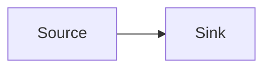

# Mermaid Diagrams

Goal: Create Mermaid source that renders cleanly and communicates one precise workflow, system, data model, or architecture.

Success means:
- The diagram type matches the information shape and target renderer.
- The Mermaid source uses clear node IDs, quoted labels, and readable edge labels.
- Icon usage names the required renderer registration path.
- The final answer includes the diagram source, target file or markdown location, and validation notes.

Stop when: The requested diagram is ready to paste or save and the validation path is stated.

## Reference Map

- `references/syntax-selection.md`: choose the right Mermaid diagram type and start from the smallest useful structure.
- `references/architecture-icons.md`: build `architecture-beta` diagrams and register real Iconify software icons.
- `references/flowchart-patterns.md`: write readable flowcharts, icon/image nodes, styles, subgraphs, and edge labels.
- `references/data-platform-diagrams.md`: model databases, caches, queues, streaming systems, CDC, workflow engines, and analytics stacks.
- `references/rendering-validation.md`: render, lint, and debug `.mmd` files across Markdown, Mermaid Live, browser embeds, and CLI tools.
- `references/example-index.md`: choose from the bundled `.mmd` examples.
- `examples/*.mmd`: copyable Mermaid source files for architecture, icons, CDC, workflow, sequence, ERD, and state patterns.

## Workflow

1. Read the surrounding repo docs, code, schema, logs, or user notes that define the system being drawn.
2. Choose the diagram type with `references/syntax-selection.md`.
3. Load the narrow reference for the chosen type and the target renderer.
4. Start from a bundled `.mmd` example when it matches the task.
5. Use real software icons through registered Iconify packs when the renderer supports them.
6. Use labels and edge text to show causality, ownership, protocols, and failure or retry paths.
7. Validate the diagram with the closest available renderer.
8. Return the Mermaid source or patch the requested `.mmd`/Markdown file.

## Icon Rule

Use `architecture-beta` when the user asks for software logos in an architecture view. Register the needed Iconify packs in the renderer, then reference icons as `pack:icon-name`.

Use flowchart icon shapes when the user needs a normal flowchart with logo-like nodes. Register the same icon packs before rendering.

Use Mermaid built-in icons such as `database`, `server`, `cloud`, `internet`, and `disk` in renderers without custom Iconify registration.

Route DragonflyDB and Redpanda through custom icon assets or generic built-in icons until a verified Iconify product icon is available in the target renderer.

## Output Shape

For Markdown answers, return a fenced block:

````markdown

````

For repository artifacts, write a `.mmd` file when the diagram should be rendered by tools, docs, or CI. Write Markdown when the diagram should live inline with prose.
