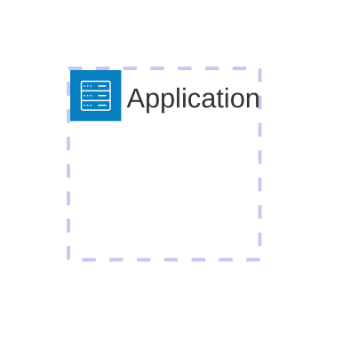
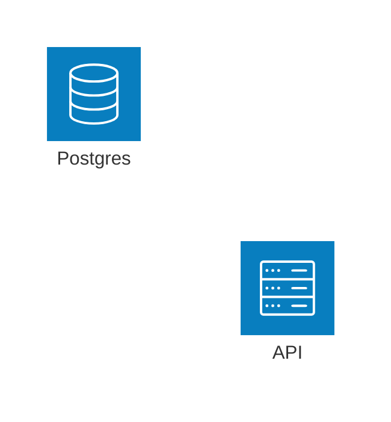
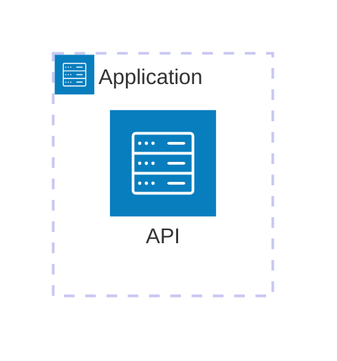
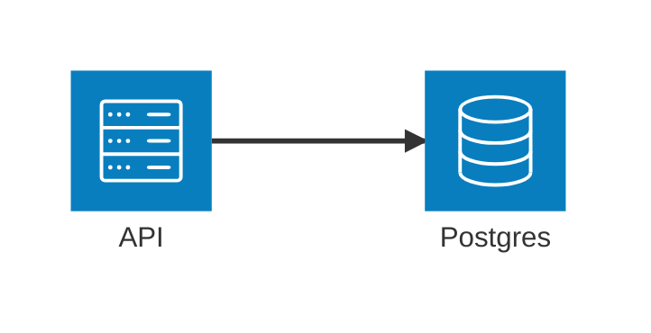
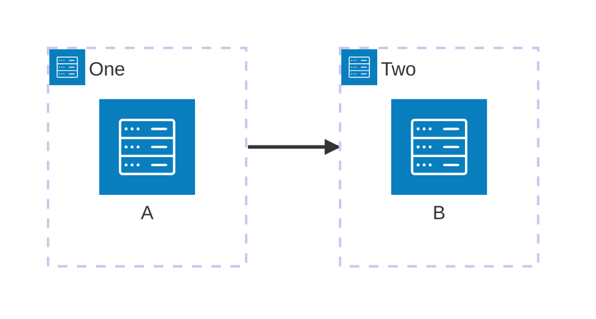
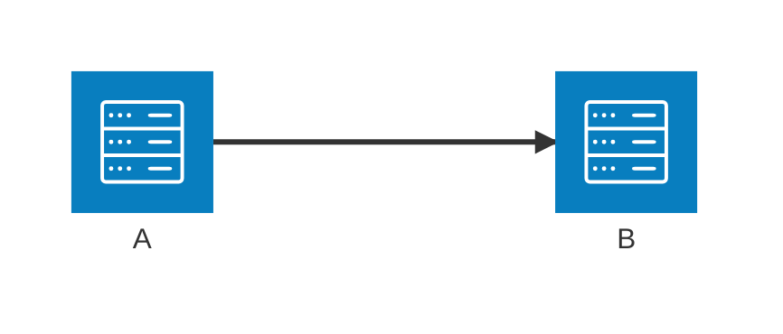

# Architecture Diagrams And Icons

Use this reference for Mermaid `architecture-beta` diagrams and real software icons.

Sources:
- Architecture diagrams: https://mermaid.js.org/syntax/architecture.html
- Icon pack registration: https://mermaid.js.org/config/icons.html
- Icon search: https://iconify.design/

## Contents

- [Architecture Syntax](#architecture-syntax)
- [Built-In Icons](#built-in-icons)
- [Register Iconify Packs](#register-iconify-packs)
- [Verified Icon Names](#verified-icon-names)
- [Custom Icon Cases](#custom-icon-cases)
- [Layout Tuning](#layout-tuning)

## Architecture Syntax

Start with `architecture-beta`.

Declare groups:



Declare services:



Attach services to groups:



Connect services with side-aware edges:



Use `{group}` when the edge should attach to group boundaries through a service:



## Built-In Icons

Mermaid architecture diagrams include these built-in icons:

- `cloud`
- `database`
- `disk`
- `internet`
- `server`

Use these built-ins when the renderer cannot register Iconify packs.

## Register Iconify Packs

Register icon packs in the renderer before using `pack:icon-name` inside `architecture-beta` or flowchart icon shapes.

```html
<script type="module">
  import mermaid from "https://cdn.jsdelivr.net/npm/mermaid@11/dist/mermaid.esm.min.mjs";

  mermaid.registerIconPacks([
    {
      name: "logos",
      loader: () =>
        fetch("https://unpkg.com/@iconify-json/logos@1/icons.json").then((res) => res.json()),
    },
    {
      name: "simple-icons",
      loader: () =>
        fetch("https://unpkg.com/@iconify-json/simple-icons@1/icons.json").then((res) =>
          res.json()
        ),
    },
  ]);

  mermaid.initialize({ startOnLoad: true });
</script>
```

Then use registered icon names:

```mermaid
architecture-beta
    service postgres(logos:postgresql)[Postgres]
    service temporal(simple-icons:temporal)[Temporal]
```



For Mermaid CLI, pass the same packs explicitly:

```sh
npx -y @mermaid-js/mermaid-cli \
  --iconPacks @iconify-json/logos @iconify-json/simple-icons \
  -i examples/architecture-data-platform-icons.mmd \
  -o /tmp/architecture-data-platform-icons.svg
```

## Verified Icon Names

These names were checked against `@iconify-json/logos@1`, `@iconify-json/simple-icons@1`, and Iconify search on 2026-05-23.

| Product | Preferred icon | Alternate icon |
| --- | --- | --- |
| Postgres | `logos:postgresql` | `simple-icons:postgresql` |
| MySQL | `logos:mysql` | `logos:mysql-icon`, `simple-icons:mysql` |
| MariaDB | `logos:mariadb` | `logos:mariadb-icon`, `simple-icons:mariadb` |
| Temporal | `simple-icons:temporal` | built-in `server` |
| Kafka | `logos:kafka` | `logos:kafka-icon`, `simple-icons:apachekafka` |
| Redis | `logos:redis` | `simple-icons:redis` |
| TiDB | `simple-icons:tidb` | built-in `database` |
| Flink | `logos:apache-flink` | `logos:apache-flink-icon`, `simple-icons:apacheflink` |
| Spark | `logos:apache-spark` | `simple-icons:apachespark` |
| Hadoop / HDFS | `logos:hadoop` | `simple-icons:apachehadoop` |
| Cassandra | `logos:cassandra` | `simple-icons:apachecassandra` |
| MongoDB | `logos:mongodb` | `logos:mongodb-icon`, `simple-icons:mongodb` |
| ClickHouse | `simple-icons:clickhouse` | built-in `database` |
| OpenSearch | `logos:opensearch` | `logos:opensearch-icon`, `simple-icons:opensearch` |
| Elasticsearch | `logos:elasticsearch` | `simple-icons:elasticsearch` |
| RabbitMQ | `logos:rabbitmq` | `logos:rabbitmq-icon`, `simple-icons:rabbitmq` |
| NATS | `logos:nats` | `logos:nats-icon`, `simple-icons:natsdotio` |
| Pulsar | `simple-icons:apachepulsar` | built-in `server` |
| Airflow | `logos:airflow` | `logos:airflow-icon`, `simple-icons:apacheairflow` |
| Prometheus | `logos:prometheus` | `simple-icons:prometheus` |
| Grafana | `logos:grafana` | `simple-icons:grafana` |
| DragonflyDB | custom icon asset | built-in `database` |
| Redpanda | custom icon asset | built-in `database` or `server` |

## Custom Icon Cases

Use a custom Iconify pack when the product logo is absent from public Iconify packs and the user provides approved SVG assets.

```js
import mermaid from "mermaid";
import { icons as logos } from "@iconify-json/logos";

const customIcons = {
  prefix: "local",
  icons: {
    redpanda: {
      body: "<path d=\"...\"/>",
      width: 24,
      height: 24,
    },
  },
};

mermaid.registerIconPacks([
  { name: "logos", icons: logos },
  { name: "local", icons: customIcons },
]);
```

Then reference the custom icon:

```mermaid
architecture-beta
    service redpanda(local:redpanda)[Redpanda]
```



## Layout Tuning

Use architecture init config for large graphs:



Use deterministic layout by default. Set `randomize: true` only when manually exploring alternative arrangements.
