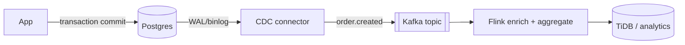
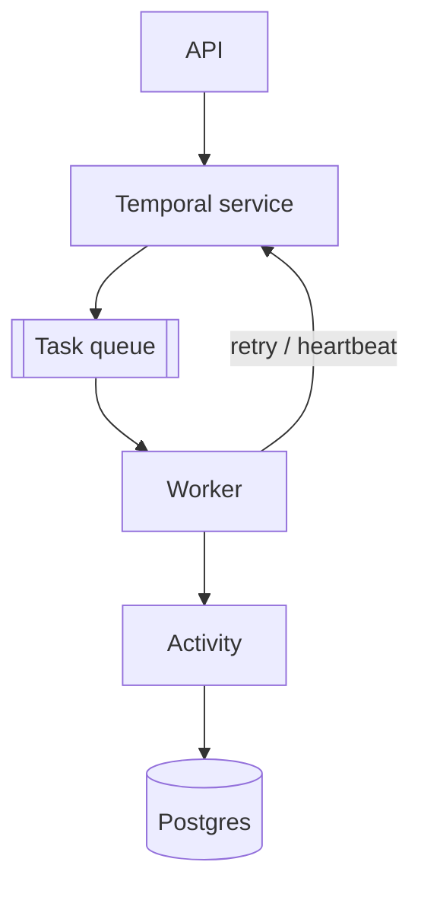
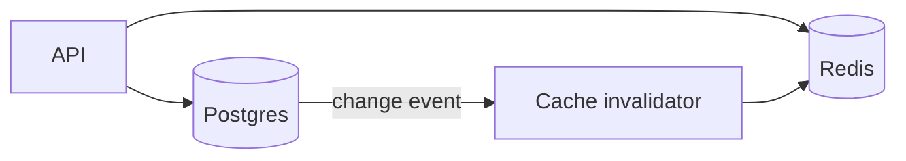
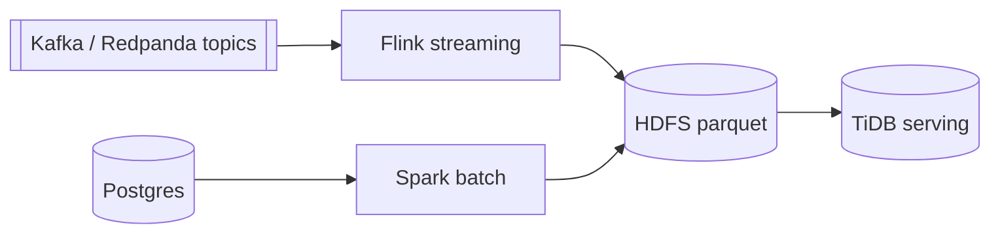
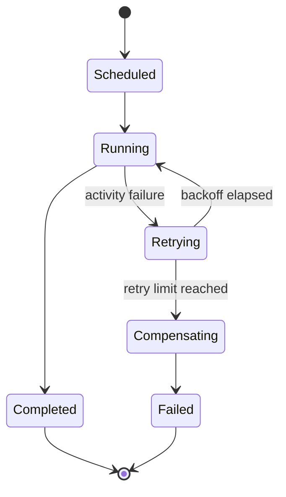

# Data Platform Diagrams

Use this reference to draw databases, queues, streaming platforms, workflow engines, CDC paths, caches, lakehouse jobs, and analytical stores.

## Contents

- [Common Node Semantics](#common-node-semantics)
- [Event Stream Pattern](#event-stream-pattern)
- [Temporal Pattern](#temporal-pattern)
- [Cache Pattern](#cache-pattern)
- [Analytics Pattern](#analytics-pattern)
- [Failure And Recovery Pattern](#failure-and-recovery-pattern)
- [Icon Strategy For Data Systems](#icon-strategy-for-data-systems)

## Common Node Semantics

| Concept | Mermaid shape | Notes |
| --- | --- | --- |
| OLTP database | `db[("Postgres")]` or architecture `database` | Name the engine and primary data set. |
| Cache | `cache[("Redis")]` | Label TTL or consistency when relevant. |
| Event broker | `topic[["Kafka topic"]]` | Use a double bracket for queues/topics in flowcharts. |
| Workflow engine | `temporal["Temporal"]` | Show task queues and workers separately when behavior matters. |
| Worker pool | `worker["Worker pool"]` | Label concurrency, retry owner, or activity type when relevant. |
| CDC connector | `debezium["Debezium"]` | Show source tables and emitted topics. |
| Stream processor | `flink["Flink job"]` | Label windows, joins, and sinks. |
| Batch processor | `spark["Spark job"]` | Label schedule, partitioning, and outputs. |
| Object store or HDFS | `hdfs[("HDFS")]` | Label file format and partition key. |

## Event Stream Pattern

Represent the durable source of truth before the derived stream.

## Temporal Pattern

Show the task queue when debugging routing, scaling, or workers. Show activities when explaining external side effects.

## Cache Pattern

Label cache-aside, write-through, read-through, or invalidation. Add TTL when it drives behavior.

## Analytics Pattern

Show stream and batch lanes separately when both feed the same serving layer.

## Failure And Recovery Pattern

Use state diagrams for retry, compensation, cancellation, and timeout behavior. Use flowcharts for component topology.

## Icon Strategy For Data Systems

Use `architecture-beta` for high-level maps with real icons:

- `logos:postgresql`
- `logos:mysql`
- `simple-icons:temporal`
- `logos:kafka`
- `logos:redis`
- `simple-icons:tidb`
- `logos:apache-flink`
- `logos:apache-spark`
- `logos:hadoop`

Use built-in `database` for DragonflyDB and Redpanda unless the user supplies a verified logo asset or renderer-specific custom Iconify pack.
