# Flowchart Patterns

Use this reference for Mermaid flowcharts, icon nodes, image nodes, subgraphs, classes, and edge labels.

Sources:
- Flowchart syntax: https://mermaid.js.org/syntax/flowchart.html
- Icon pack registration: https://mermaid.js.org/config/icons.html

## Contents

- [Basic Form](#basic-form)
- [Useful Shapes](#useful-shapes)
- [Icon Shape](#icon-shape)
- [Image Shape](#image-shape)
- [Subgraphs](#subgraphs)
- [Styling](#styling)
- [Edge Labels](#edge-labels)
- [Syntax Hygiene](#syntax-hygiene)

## Basic Form

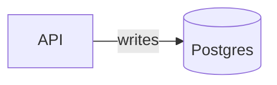

Use `LR` for pipeline and request flow. Use `TD` for decisions, lifecycles, and runbooks.

## Useful Shapes

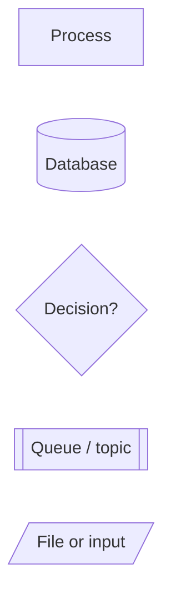

Use the expanded shape syntax when the semantic shape matters:

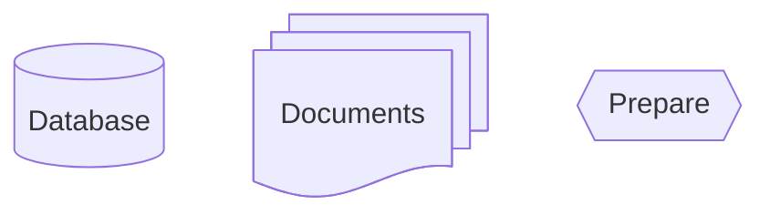

## Icon Shape

Register the icon pack in the renderer first. Then use the flowchart `icon` shape:

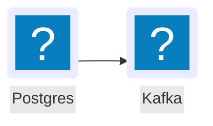

Parameters:

- `icon`: registered `pack:name`.
- `form`: `square`, `circle`, or `rounded`.
- `label`: visible text.
- `pos`: `t` or `b`.
- `h`: icon height.

## Image Shape

Use image nodes when the renderer can fetch a trusted image URL and the target logo is not available as an Iconify icon.

```mermaid
flowchart LR
    custom@{ img: "https://example.com/approved-logo.svg", label: "Custom service", pos: "b", h: 64, constraint: "on" }
    api["API"] --> custom
```

Use approved local or hosted assets. Record the asset source next to the diagram when the logo source matters.

## Subgraphs

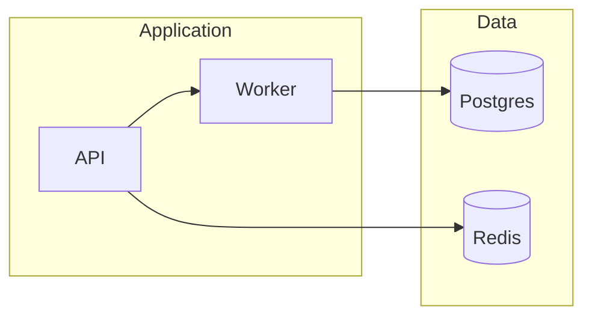

Use subgraphs for ownership, deployment boundaries, trust zones, and data planes.

## Styling

Use classes for semantic meaning:

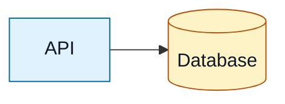

Use colors to communicate one dimension: service type, risk, status, owner, or environment.

## Edge Labels

Label edges with the thing that moves:

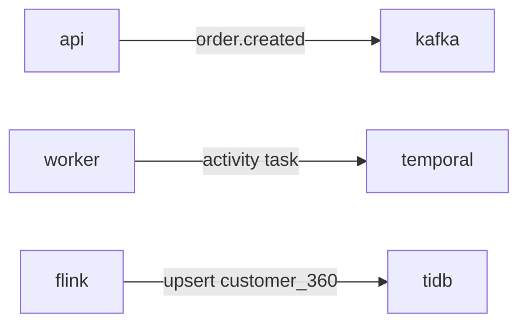

Use thick arrows for critical paths:

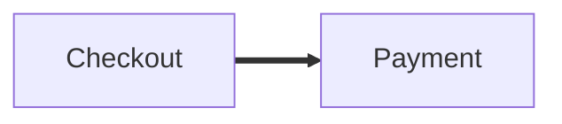

Use dotted arrows for async, optional, or eventually consistent paths:

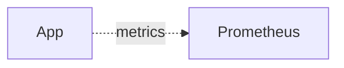

## Syntax Hygiene

Quote labels with punctuation:

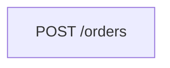

Capitalize or quote terminal labels that say `End`:

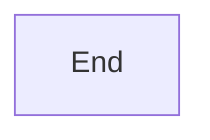

Add a space or capitalization when an edge target starts with `o` or `x`:

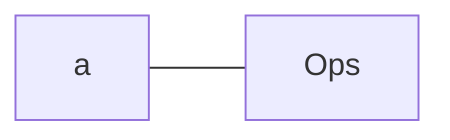

Keep chained one-line syntax readable. Expand dense chains when the source will be maintained by humans.
