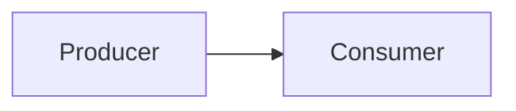
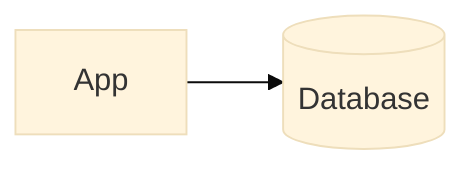
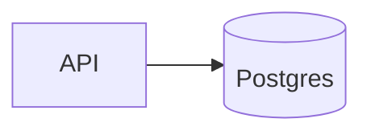
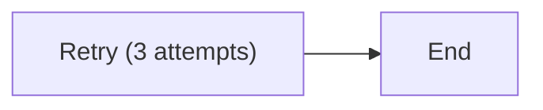
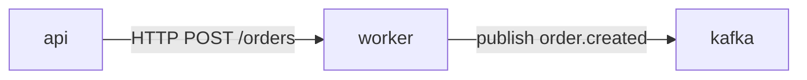
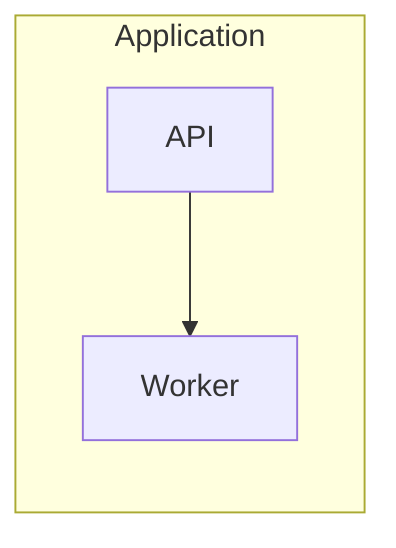

# Syntax Selection

Use this reference to choose the Mermaid diagram type before writing syntax.

Sources:
- Mermaid syntax reference: https://mermaid.js.org/intro/syntax-reference.html
- Mermaid usage guide: https://mermaid.js.org/config/usage.html
- Mermaid examples: https://mermaid.js.org/syntax/examples.html

## Selection Table

| User intent | Use | Starting point |
| --- | --- | --- |
| System components with software logos | `architecture-beta` | `examples/architecture-data-platform-icons.mmd` |
| Workflow, pipeline, request path, or dependency graph | `flowchart` | `examples/flowchart-cdc-pipeline.mmd` |
| Call order across services or actors | `sequenceDiagram` | `examples/sequence-temporal-kafka.mmd` |
| Entity relationships and cardinality | `erDiagram` | `examples/erd-commerce-events.mmd` |
| Workflow lifecycle, retries, compensation, failure states | `stateDiagram-v2` | `examples/state-workflow-retries.mmd` |
| C4-style container view in a renderer that supports C4 | `C4Container` | Write inline after checking renderer support |
| Timeline of incidents, releases, or migrations | `timeline` | Write inline for chronology |
| Proportions or hierarchical size | `treemap-beta` | Write inline for comparative hierarchy |

## Core Structure

Start every Mermaid file with the diagram declaration:



Use frontmatter-style init directives when the renderer supports them:



Use Mermaid comments for notes that should stay in the source:

```mermaid
%% Requires logos and simple-icons packs in the renderer.
```

## Label Rules

Use short stable node IDs:



Quote labels that contain punctuation, parentheses, slashes, brackets, or reserved words:



Use one node per meaningful concept. Split overloaded labels into separate nodes when the label starts carrying two jobs.

## Edge Rules

Use edge labels for protocols, topics, commands, and guarantees:



Use direction to preserve reading order:

- `LR`: user or data moves left to right.
- `TD`: lifecycle or decision tree moves top to bottom.
- `BT`: supporting infrastructure feeds upward.

Use subgraphs for deployment or ownership boundaries:



## Renderer Fit

Use broadly supported diagram types for docs platforms with older Mermaid versions. Use `architecture-beta`, icon shapes, and newer beta diagrams when the target renderer is Mermaid 11+ or the user can control the renderer.

Check renderer support before relying on these newer features:

- `architecture-beta`
- flowchart `icon` and `image` special shapes
- `radar-beta`, `treemap-beta`, `kanban`, `packet`, and other newer diagram types
- layout tuning options under `%%{init: ...}%%`
